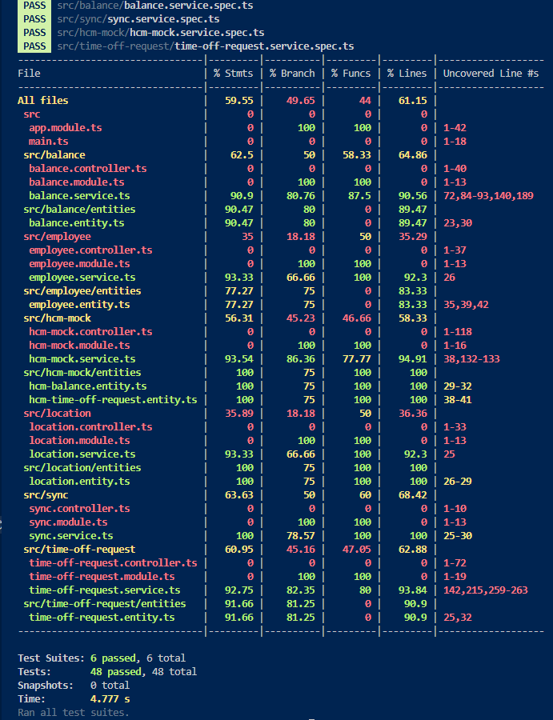

# 📌 ExampleHR Time-Off Microservice

A backend microservice built with **NestJS + SQLite** to manage the lifecycle of employee time-off requests, ensuring **balance consistency** while integrating with an external **HCM system (mocked)**.

---

# 🧠 Overview

This service handles:

- Employee time-off requests
- Local balance management with defensive mechanisms
- Integration with an external HCM (source of truth)
- Synchronization strategies between systems

The system prioritizes **data integrity**, **defensive architecture**, and **robust test coverage**.

---

# 🏗️ Architecture

### Core Modules

- Employee
- Location
- Balance
- TimeOffRequest
- HcmMock
- Sync

### Data Model

```

Employee ──1:M── Balance ──1:M── TimeOffRequest
│                    │
└───────1:M──────────┘
│
Location

```

---

# 🔄 Core Flow

### Time-Off Request Lifecycle

1. Employee submits a request
2. System checks local balance
3. If sufficient:
   - Days are **reserved**
   - Request is stored as `PENDING`
4. On approval:
   - Call HCM API
   - If success → commit (reserved → used)
   - If failure → rollback reservation
5. Final state:
   - `APPROVED` or `REJECTED`

---

# 🛡️ Defensive Strategy

- Local balance cache to avoid excessive HCM calls
- Reservation system (`reserved`) to prevent overbooking
- Commit (`used`) only after HCM confirmation
- Rollback on failure
- Idempotency support
- HCM failure simulation (timeouts, silent failures, etc.)
- Safe batch sync (skips invalid records)

---

# 🔌 HCM Integration (Mock)

Simulated HCM behavior includes:

- 70% success
- 10% insufficient balance
- 10% random failure
- 5% timeout
- 5% silent ignore

Endpoints:

```

GET  /hcm/balance/:employeeId/:locationId
POST /hcm/time-off
GET  /hcm/batch
POST /hcm/seed

```

---

# 🌐 API Endpoints

### Employees

```

POST /employees
GET  /employees
GET  /employees/:externalId

```

### Locations

```

POST /locations
GET  /locations
GET  /locations/:externalId

```

### Balances

```

GET  /balances
GET  /balances/:employeeId/:locationId
POST /balances/sync

```

### Time-Off Requests

```

POST /time-off-requests
GET  /time-off-requests
GET  /time-off-requests/:id
GET  /time-off-requests/employee/:employeeId
POST /time-off-requests/:id/approve
POST /time-off-requests/:id/reject

```

### Sync

```

POST /sync/hcm

```

---

# 🔄 Phase 4 — Sync & Reconciliation

A lightweight synchronization mechanism was implemented:

- Scheduled sync using NestJS Schedule (CRON)
- Manual trigger via `POST /sync/hcm`
- Defensive batch processing (invalid records are skipped)

### Reconciliation Strategy

- Detects mismatches between local and HCM balances
- Reports conflicts without breaking the sync process
- Enables safe operation even with inconsistent external data

Example:

```

POST /sync/hcm
synced: 1
skipped: 5
conflicts: 0

````

Conflicts include:

- employeeId
- locationId
- local vs HCM balance
- difference

---

# 🧪 Testing Strategy

The system focuses on **business-critical logic testing**.

### Covered Services

- BalanceService
- TimeOffRequestService
- HcmMockService
- SyncService
- EmployeeService
- LocationService

### Commands

```bash
npm test
npm run test:cov
````

---

# 📊 Test Coverage

Coverage generated using Jest:

* Core business services: ~90–100%
* Overall coverage: ~60%

Coverage focuses on **business logic**, not framework boilerplate (controllers/modules).



---

# 🧪 Validation Evidence

The system was manually validated across all endpoints.

### Happy Path

1. Created location
2. Created employee
3. Synced balance
4. Created request
5. Approved request
6. Verified balance

Result:

* Initial: `available = 10`
* Final: `available = 5`, `used = 5`

### Additional Tests

* GET endpoints for all modules
* Reject flow
* HCM mock endpoints
* Sync endpoint

---

# ⚠️ Known Limitations

* HCM seed uses external IDs and may not match local UUID schema
* No advanced conflict resolution (only detection)
* No retry queue for failed HCM operations

---

# 🔮 Future Work

* Scheduled reconciliation jobs with retry logic
* Conflict resolution workflow
* Observability (logs, metrics)
* Full E2E automation

---

# ⚙️ Setup & Run

```bash
npm install
npm run build
node dist/main.js
```

---

# 🧠 Key Design Decisions

* HCM is source of truth, local cache for performance
* Reservation model ensures consistency
* Defensive design for unreliable external systems
* Lightweight reconciliation instead of complex workflows

---

# 🏁 Conclusion

This implementation demonstrates a robust and production-aware approach to time-off management, emphasizing correctness, defensive design, and clear trade-offs under real-world constraints.

It reflects real-world backend considerations such as eventual consistency, external system failures, and state synchronization.
