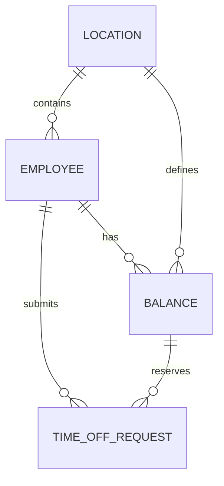

# TRD - Time-Off (Vacation/Leave) Microservice

**Project**: ExampleHR Time-Off Microservice  
**Version**: 1.0  
**Date**: April 23, 2026  
**Status**: Approved (Locked Requirements)

---

## Locked Requirements

| # | Requirement | Implementation |
|---|-------------|----------------|
| 1 | **Database** | TypeORM with SQLite |
| 2 | **Status Storage** | VARCHAR(20), avoiding database enum coupling |
| 3 | **Idempotency** | `idempotencyKey` field on Balance and TimeOffRequest |
| 4 | **Location Context** | `locationId` explicitly stored on TimeOffRequest and Balance |
| 5 | **Approval Flow** | Reserve days locally, confirm with HCM, then commit or release |
| 6 | **HCM Mock** | Real-time and batch mock endpoints with simulated failure modes |
| 7 | **Sync Strategy** | Scheduled/manual HCM batch sync with lightweight reconciliation |

---

## 1. Overview of the Microservice Architecture

### 1.1 System Context

The ExampleHR system manages employee time-off (vacation/leave) requests. However, the HCM system (e.g., Workday) is the **Source of Truth** for leave balances. This creates a distributed system challenge where:

- **HCM System**: Holds authoritative balance data, provides real-time and batch APIs
- **ExampleHR**: Frontend for employees to request time off, managers to approve/reject

### 1.2 Architecture Diagram

```
┌─────────────────────────────────────────────────────────────────────────────┐
│                           ExampleHR Microservice                            │
├─────────────────────────────────────────────────────────────────────────────┤
│                                                                             │
│  ┌──────────────┐    ┌──────────────┐    ┌──────────────┐                 │
│  │   REST API   │───▶│   Services   │───▶│  Repository  │                 │
│  │ Controllers  │    │  (Business) │    │   (TypeORM)  │                 │
│  └──────────────┘    └──────────────┘    └──────────────┘                 │
│         │                   │                   │                         │
│         ▼                   ▼                   ▼                         │
│  ┌──────────────────────────────────────────────────────────────────┐     │
│  │                      Core Modules                                │     │
│  │  ┌────────────┐  ┌────────────┐  ┌────────────┐  ┌────────────┐ │     │
│  │  │  Employee  │  │  Location  │  │  Balance   │  │ TimeOffReq │ │     │
│  │  │  Service   │  │  Service   │  │  Service   │  │  Service   │ │     │
│  │  └────────────┘  └────────────┘  └────────────┘  └────────────┘ │     │
│  └──────────────────────────────────────────────────────────────────┘     │
│                                    │                                        │
│                                    ▼                                        │
│  ┌──────────────────────────────────────────────────────────────────┐     │
│  │                    Synchronization Layer                         │     │
│  │  ┌────────────────────┐    ┌────────────────────┐                │     │
│  │  │  Real-time Sync    │    │   Batch Sync      │                │     │
│  │  │  (on request/      │    │   (CRON Job)      │                │     │
│  │  │    approval)       │    │   (nightly)      │                │     │
│  │  └────────────────────┘    └────────────────────┘                │     │
│  └──────────────────────────────────────────────────────────────────┘     │
│                                                                             │
└─────────────────────────────────────────────────────────────────────────────┘
                                    │
                    ┌───────────────┴───────────────┐
                    ▼                               ▼
          ┌─────────────────┐             ┌─────────────────┐
          │   HCM Mock      │             │   HCM Real      │
          │   (Development) │             │   (Production)  │
          └─────────────────┘             └─────────────────┘
```

### 1.3 Module Structure

| Module | Responsibility |
|--------|----------------|
| `EmployeeModule` | Manage employee data (id, name, email, locationId) |
| `LocationModule` | Manage locations (id, name, timezone) |
| `BalanceModule` | Manage leave balances, local cache, reconciliation |
| `TimeOffRequestModule` | Handle vacation requests, lifecycle management |
| `HcmMockModule` | Simulate HCM API (real-time + batch) |
| `SyncModule` | Handle synchronization between ExampleHR and HCM |

---

## 2. SQLite Database Modeling

### 2.1 Entity Relationship Diagram



### 2.2 Tables

#### 2.2.1 Employee Table

| Column | Type | Constraints | Description |
|--------|------|--------------|-------------|
| `id` | UUID | PK, NOT NULL | Unique identifier |
| `externalId` | VARCHAR(50) | UNIQUE, NOT NULL | Employee ID from HCM |
| `name` | VARCHAR(255) | NOT NULL | Full name |
| `email` | VARCHAR(255) | UNIQUE, NOT NULL | Email address |
| `locationId` | UUID | FK, NOT NULL | Reference to Location |
| `createdAt` | DATETIME | NOT NULL | Creation timestamp |
| `updatedAt` | DATETIME | NOT NULL | Last update timestamp |

#### 2.2.2 Location Table

| Column | Type | Constraints | Description |
|--------|------|--------------|-------------|
| `id` | UUID | PK, NOT NULL | Unique identifier |
| `externalId` | VARCHAR(50) | UNIQUE, NOT NULL | Location ID from HCM |
| `name` | VARCHAR(255) | NOT NULL | Location name |
| `timezone` | VARCHAR(50) | NOT NULL | IANA timezone |
| `createdAt` | DATETIME | NOT NULL | Creation timestamp |
| `updatedAt` | DATETIME | NOT NULL | Last update timestamp |

#### 2.2.3 Balance Table

| Column | Type | Constraints | Description |
|--------|------|--------------|-------------|
| `id` | UUID | PK, NOT NULL | Unique identifier |
| `employeeId` | UUID | FK, NOT NULL | Reference to Employee |
| `locationId` | UUID | FK, NOT NULL | Reference to Location |
| `balance` | INTEGER | NOT NULL, DEFAULT 0 | Available days |
| `reserved` | INTEGER | NOT NULL, DEFAULT 0 | Days reserved (pending) |
| `used` | INTEGER | NOT NULL, DEFAULT 0 | Days used (approved) |
| `lastSyncedAt` | DATETIME | NULL | Last sync with HCM |
| `hcmVersion` | VARCHAR(50) | NULL | HCM record version |
| `idempotencyKey` | VARCHAR(100) | UNIQUE, NULL | Key for idempotency protection |
| `createdAt` | DATETIME | NOT NULL | Creation timestamp |
| `updatedAt` | DATETIME | NOT NULL | Last update timestamp |

**Unique Constraint**: `(employeeId, locationId)`

#### 2.2.4 TimeOffRequest Table

| Column | Type | Constraints | Description |
|--------|------|--------------|-------------|
| `id` | UUID | PK, NOT NULL | Unique identifier |
| `employeeId` | UUID | FK, NOT NULL | Reference to Employee |
| `locationId` | UUID | FK, NOT NULL | Reference to Location (explicit balance context) |
| `startDate` | DATE | NOT NULL | Request start date |
| `endDate` | DATE | NOT NULL | Request end date |
| `days` | INTEGER | NOT NULL | Number of days requested |
| `status` | VARCHAR(20) | NOT NULL, CHECK (status IN ('PENDING','HCM_SYNCING','APPROVED','REJECTED')) | Request status as string |
| `reason` | TEXT | NULL | Reason for request/rejection |
| `hcmResponseId` | VARCHAR(100) | NULL | Reference to HCM response |
| `localApproval` | BOOLEAN | DEFAULT false | Manager approved locally |
| `hcmApproved` | BOOLEAN | DEFAULT false | HCM approved |
| `idempotencyKey` | VARCHAR(100) | UNIQUE, NULL | Key for idempotency protection |
| `createdAt` | DATETIME | NOT NULL | Creation timestamp |
| `updatedAt` | DATETIME | NOT NULL | Last update timestamp |

**Unique Constraint**: `(employeeId, startDate, days)` for idempotency

---

## 2.3 Audit Trail

### 2.3.1 BalanceAudit Table

| Column | Type | Constraints | Description |
|--------|------|--------------|-------------|
| `id` | UUID | PK, NOT NULL | Unique identifier |
| `balanceId` | UUID | FK, NOT NULL | Reference to Balance |
| `employeeId` | UUID | NOT NULL | Employee ID for traceability |
| `locationId` | UUID | NOT NULL | Location ID for traceability |
| `action` | VARCHAR(50) | NOT NULL | Action type: RESERVE, RELEASE, USE, SYNC, ADJUST |
| `previousBalance` | INTEGER | NOT NULL | Balance before change |
| `newBalance` | INTEGER | NOT NULL | Balance after change |
| `previousReserved` | INTEGER | NOT NULL | Reserved before change |
| `newReserved` | INTEGER | NOT NULL | Reserved after change |
| `previousUsed` | INTEGER | NOT NULL | Used before change |
| `newUsed` | INTEGER | NOT NULL | Used after change |
| `trigger` | VARCHAR(50) | NOT NULL | Trigger: REQUEST, APPROVAL, BATCH, MANUAL |
| `requestId` | UUID | NULL | Related TimeOffRequest (if any) |
| `hcmResponseId` | VARCHAR(100) | NULL | HCM response reference |
| `metadata` | JSON | NULL | Additional context |
| `createdAt` | DATETIME | NOT NULL | Creation timestamp |

### 2.3.2 TimeOffRequestAudit Table

| Column | Type | Constraints | Description |
|--------|------|--------------|-------------|
| `id` | UUID | PK, NOT NULL | Unique identifier |
| `requestId` | UUID | FK, NOT NULL | Reference to TimeOffRequest |
| `previousStatus` | VARCHAR(20) | NULL | Status before transition |
| `newStatus` | VARCHAR(20) | NOT NULL | Status after transition |
| `action` | VARCHAR(50) | NOT NULL | Action: CREATE, APPROVE, REJECT, SYNC, CANCEL |
| `actor` | VARCHAR(100) | NULL | Who triggered (user, system, hcm) |
| `reason` | TEXT | NULL | Reason for transition |
| `hcmResponseId` | VARCHAR(100) | NULL | HCM response reference |
| `createdAt` | DATETIME | NOT NULL | Creation timestamp |

---

## 3. Defensive State Management

### 3.1 The Challenge

The HCM system is **unstable**:
- Balances can change externally (e.g., birthday bonus, manual HR adjustments)
- May not return errors when an employee tries to take more days than available
- Real-time API may fail silently
- Batch sync may have conflicts with pending local requests

### 3.2 Defensive Strategy

#### 3.2.1 Local Balance Cache

We maintain a **local cache** of balances that is **optimistic**:

```
┌─────────────────────────────────────────────────────────────────┐
│                    Balance State Machine                        │
├─────────────────────────────────────────────────────────────────┤
│                                                                 │
│   ┌──────────┐    Request       ┌──────────────┐               │
│   │  Local   │─────── ─ ─ ─ ─▶│   PENDING    │               │
│   │ Balance  │    (deduct      │   (reserved) │               │
│   │   10     │    from local)  │      8       │               │
│   └──────────┘                  └──────────────┘               │
│        │                              │                         │
│        │                              ▼                         │
│        │                      ┌──────────────┐                 │
│        │                      │ HCM_SYNCING  │                 │
│        │                      │ (awaiting    │                 │
│        │                      │  HCM response)                 │
│        │                      └──────────────┘                 │
│        │                              │                         │
│        ▼                              ▼                         │
│   ┌──────────┐                  ┌──────────────┐                 │
│   │  HCM     │◀─── Sync ──────│   APPROVED   │                 │
│   │ Balance  │    (reconcile) │   (confirmed)│                 │
│   │    8     │                  │      8       │                 │
│   └──────────┘                  └──────────────┘                 │
│                                                                 │
└─────────────────────────────────────────────────────────────────┘
```

#### 3.2.2 Optimistic Update Flow

1. **Request Time Off**:
   - Check local balance (cached value)
   - If `localBalance - reserved >= requestedDays`: Proceed
   - Reserve days locally: `reserved += requestedDays`
   - Create request with status `PENDING`

2. **Manager Approval**:
   - Change status to `HCM_SYNCING`
   - Call HCM real-time API to validate
   - On success: 
     - Change to `APPROVED`
     - **Release `reserved`** (decrement reserved)
     - **Increment `used`** (add to used days)
     - Create audit trail entry
   - On failure: 
     - Change to `REJECTED`
     - Release reservation (increment available)
     - Create audit trail entry

3. **Batch Reconciliation** (Nightly CRON):
   - Fetch all balances from HCM Batch API
   - Compare with local balances
   - Resolve discrepancies:
     - If HCM > Local: Update local (external credit)
     - If Local > HCM: Flag for investigation
     - If pending requests affected: Re-evaluate eligibility

#### 3.2.3 Conflict Resolution Rules

| Scenario | Local Balance | HCM Balance | Pending Requests | Action |
|----------|---------------|-------------|------------------|--------|
| External Credit | 5 | 7 | 0 | Update local to 7 |
| External Debit | 5 | 3 | 0 | Update local to 3 |
| Overdraft Risk | 5 | 3 | 4 (pending) | Flag; keep 5 until resolved |
| HCM Discrepancy | 5 | 3 | 2 (approved) | Log error; alert ops |

---

## 4. Mock Strategy to Simulate HCM

### 4.1 HcmMockModule Design

The HCM Mock will be an isolated NestJS module that simulates:

1. **Real-time API**:
   - `GET /hcm/balance/:employeeId/:locationId` - Get single balance
   - `POST /hcm/time-off` - Submit time-off request

2. **Batch API**:
   - `GET /hcm/batch` - Get all balances

### 4.2 Mock State (In-Memory)

```typescript
interface HcmBalance {
  employeeId: string;
  locationId: string;
  balance: number;
  version: string;
  lastUpdated: Date;
}

interface HcmTimeOffRequest {
  id: string;
  employeeId: string;
  startDate: string;
  endDate: string;
  days: number;
  status: 'APPROVED' | 'REJECTED' | 'PENDING';
  errorMessage?: string;
}
```

### 4.3 Simulated Failure Modes

| Mode | Probability | Behavior |
|------|-------------|----------|
| Success | 70% | Normal response |
| Balance Not Enough | 10% | Return error "Insufficient balance" |
| Random Failure | 10% | Return 500 Internal Server Error |
| Timeout | 5% | Delay response by 10+ seconds |
| Silent Ignore | 5% | Return success but not deduct balance |

### 4.4 Batch Endpoint Behavior

- Returns all balances in system
- Can simulate balance changes between calls
- Supports version tracking for conflict detection

---

## 5. Analysis of Alternatives

### 5.1 Polling vs. Webhooks for Batch System

#### Option A: Polling (CRON Job)

| Pros | Cons |
|------|------|
| Simple to implement | Near-real-time (daily/nightly) |
| No external dependency | May miss rapid changes |
| Easy to debug | Wastes resources if no changes |
| **Chosen for Phase 1** | |

#### Option B: Webhooks

| Pros | Cons |
|------|------|
| Near real-time | Requires HCM to support webhooks |
| Efficient (push vs pull) | More complex infrastructure |
| Immediate conflict detection | Requires reliable callback endpoint |

**Decision**: Start with Polling (CRON) for Phase 1-4. Webhooks can be added in a future phase if HCM supports it.

### 5.2 Database Choice: TypeORM vs. Prisma

| Criteria | TypeORM | Prisma |
|----------|---------|--------|
| SQLite Support | ✅ | ✅ |
| Type Safety | Medium | High |
| Migration | Code-based | Schema-based |
| Learning Curve | Medium | Low |
| **Chosen** | ✅ | |

**Decision**: Use **TypeORM** for this project due to:
- Native NestJS integration (`@nestjs/typeorm`)
- Mature SQLite support
- Flexible query building

---

## 6. API Endpoints (Preview)

### 6.1 Balance Endpoints

| Method | Path | Description |
|--------|------|-------------|
| GET | `/balances/:employeeId/:locationId` | Get balance for employee+location |
| GET | `/balances` | List all balances (admin) |

### 6.2 Time-Off Request Endpoints

| Method | Path | Description |
|--------|------|-------------|
| POST | `/time-off-requests` | Create new request |
| GET | `/time-off-requests` | List requests (filtered) |
| GET | `/time-off-requests/:id` | Get request details |
| POST | `/time-off-requests/:id/approve` | Manager approves |
| POST | `/time-off-requests/:id/reject` | Manager rejects |

### 6.3 HCM Mock Endpoints (Internal)

| Method | Path | Description |
|--------|------|-------------|
| GET | `/hcm/balance/:employeeId/:locationId` | Get HCM balance |
| POST | `/hcm/time-off` | Submit to HCM |
| GET | `/hcm/batch` | Get all HCM balances |

---

## 7. Testing Strategy

The testing strategy prioritizes business-critical services over framework boilerplate.

### 7.1 Unit Tests

Covered services:

- BalanceService
- TimeOffRequestService
- HcmMockService
- SyncService
- EmployeeService
- LocationService

The goal is to guard against regressions in:

- balance reservation
- commit/release logic
- HCM failures
- request approval/rejection lifecycle
- batch sync and reconciliation
- duplicate employee/location creation

### 7.2 Manual API Validation

The REST API was manually validated for:

- Location endpoints
- Employee endpoints
- Balance endpoints
- Time-off request lifecycle
- Approval flow
- Rejection flow
- HCM mock endpoints
- Sync endpoint

### 7.3 Coverage Strategy

Coverage focuses on business logic rather than framework boilerplate.

Current coverage profile:

- Core services: high coverage, generally around 90–100%
- Overall coverage: around 60%, affected by controllers/modules/entities

This is intentional because controllers and modules contain little business logic compared to services.

---
## 8. Phase Roadmap

| Phase | Deliverables | Status |
|-------|--------------|--------|
| Phase 1 | TRD | Completed |
| Phase 2 | Project setup and HCM Mock | Completed |
| Phase 3 | Core entities, services, REST controllers | Completed |
| Phase 4 | Scheduled/manual sync and lightweight reconciliation | Completed |
| Phase 5 | Unit tests, coverage, README, delivery package | Completed |

### Final Implementation Summary

The implementation includes:

- REST API for employees, locations, balances, time-off requests, HCM mock, and sync
- HCM mock with real-time and batch endpoints
- Defensive balance model with `balance`, `reserved`, and `used`
- Approval flow with HCM confirmation
- Rollback/release behavior on rejection or HCM failure
- Manual and scheduled sync support
- Lightweight reconciliation with conflict detection
- Unit tests covering the main business services

---

## 9. Future Enhancements / Open Questions

1. **Authentication**
   - Add JWT/OAuth or API keys for production use.

2. **Identifier Normalization**
   - The current API uses `externalId` for Employee/Location lookup, while internal relationships use UUIDs.
   - A production version should normalize this at the API layer.

3. **Audit Trail**
   - A full audit trail for balance/request transitions would be valuable for compliance.

4. **Advanced Reconciliation**
   - Current reconciliation detects conflicts.
   - A production system should add a manual review queue and automated retry policy.

5. **Observability**
   - Add structured logging, metrics, tracing, and health checks.

6. **Notifications**
   - Notify employees/managers when requests are approved, rejected, or require review.

---

## 10. Implementation Notes

This implementation intentionally focuses on correctness of the core business flow:

- request creation
- local balance reservation
- HCM confirmation
- commit/release transitions
- batch sync
- lightweight reconciliation

More advanced production concerns such as authentication, full audit history, observability, and manual conflict review are documented as future enhancements.

---

**End of TRD**